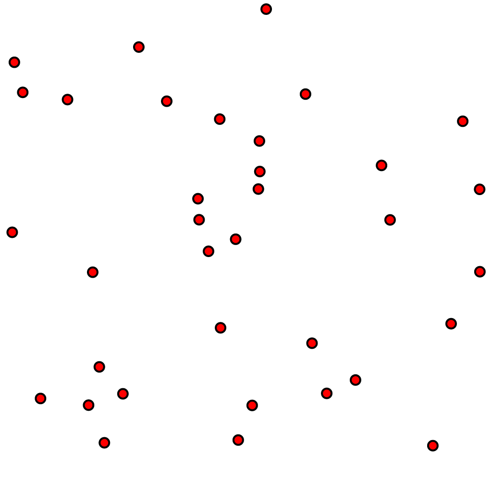
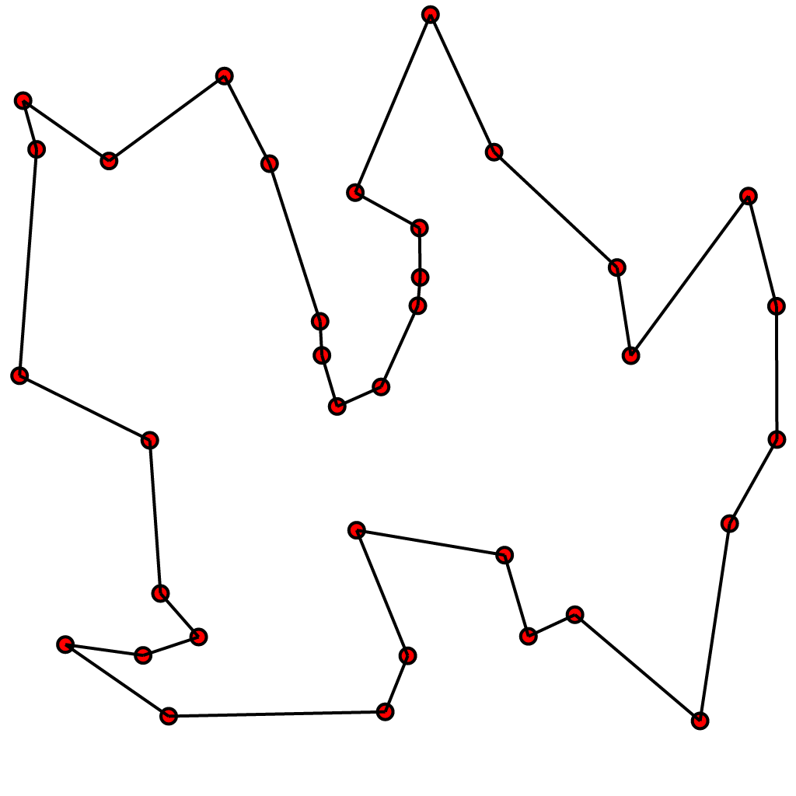
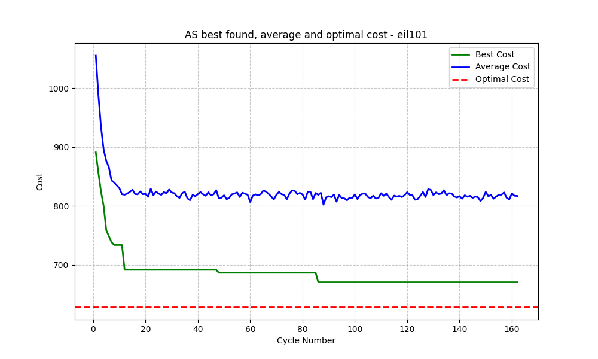
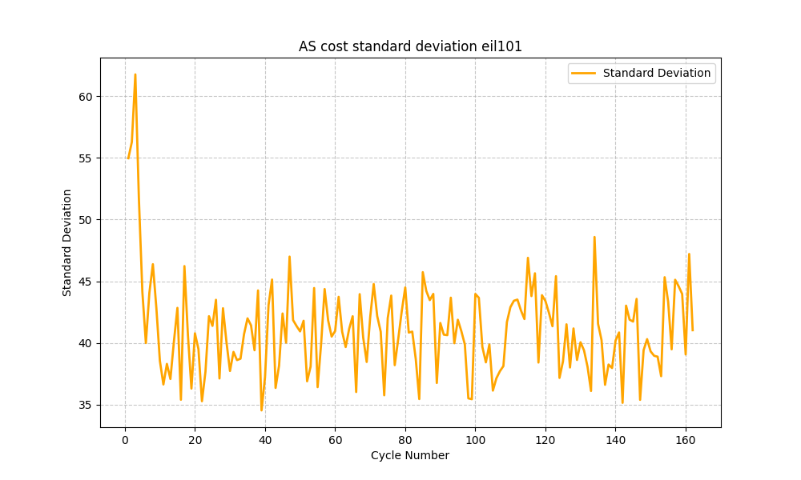

# Comparison of selected metaheuristic algorithms  

**Systems and Decision Methods** semester project at
Wrocław University of Science and Technology

**Selected metaheuristic algorithms:**
* 	Ant Colony Optimization
*   Simulated Annealing
*   Bees Algorithm

**Authors:** 
*   Przemysław Mazurowski
*   Bartłomiej Niedbała
*   Szymon Majerczak  

**Submission date:** 2026/05/31  

---

## 1. The Travelling Salesman Problem (TSP) characteristics

The travelling salesman problem is an NP-hard problem in the theory of computational complexity. It does ask the following question: *Given a list of cities and the distances between each pair of cities, what is the shortest possible route that visits each city exactly once and returns to the origin city?*

### 1.1. Definition
Formally TSP is an optimization problem that consists of finding the minimum Hamiltonian cycle in a complete weighted graph. 

Two types of TSP problem can be pointed:
* STSP - Symmetric Travelling Salesman Problem
* ATSP - Asymmetric Travelling Salesman Problem

In the Symmetric Travelling Salesman Problem (STSP), the weight of edge $(i,j)$ never differs from weight of $(j,i)$ edge for every pair of nodes. In the Asymmetric Travelling Salesman Problem (ATSP), however, these distances may vary. In this report only STSP is considered and any reference to TSP refers to STSP.

### 1.2. Problem complexity
A defining characteristic of the TSP is the fact that it is the NP-hard problem - any proposed solution, specific sequence of nodes, can be efficiently verified in polynomial time. Nonetheless, no algorithm has been discovered that can solve the TSP in polynomial time. Furthermore, TSP holds a significant place in computational complexity - every single NP problem can be reduced to an instance of TSP in polynomial time.

The TSP presents a massive computational challenge because its complexity grows factorially. For a TSP with $n$ cities, the total number of unique routes that can be evaluated is given by the formula:

$$\frac{(n-1)!}{2}$$

This combinatorial explosion means that even for a small instance of just 20 cities, the scale of available combinations expands rapidly:

$$\frac{19!}{2} \approx 6 \times 10^{16}$$

As a result, finding an exact optimal solution through brute-force computation becomes practically impossible as the number of locations increases. Way of finding near-optimal solutions to the TSP is applying metaheuristic algorithms.

### 1.3 Visualisation of the TSP instance and optimal solution

<table align = center>
  <tr>
    <td align = center>
      
       
      <em>Unsolved TSP instance.</em>
    </td>
    <td align = center>
      
       
      <em>Solution of the TSP instance.</em>
    </td>
  </tr>
</table>

Sources:
* https://en.wikipedia.org/wiki/Travelling_salesman_problem
* https://pl.wikipedia.org/wiki/Problem_komiwoja%C5%BCera
* https://en.wikipedia.org/wiki/NP-hardness
* https://en.wikipedia.org/wiki/Travelling_salesman_problem#/media/File:GLPK_solution_of_a_travelling_salesman_problem.svg
* https://en.wikipedia.org/wiki/Travelling_salesman_problem#/media/File:Illustration_of_an_unsolved_travelling_salesman_problem.svg

---

## 2. Solution representation

The TSP solution for $n$ vertices can be represented as a permutation $\pi$ of the vertex set, where $v_i$ denotes the $i$-th vertex in the sequence:

$$\pi = (v_1, v_2, \dots, v_n)$$

The weights of edges  - distances - are retrieved from a distance matrix $D$, where each element $d_{i,j}$ represents the cost of traveling from vertex $i$ to vertex $j$:

$$D = [d_{i,j}]_{n \times n}$$

The objective of the optimization is to find an optimal tour $\pi^*$ that minimizes the cost function $F(\pi)$. This function calculates the sum of distances between consecutive vertices and includes the distance from the last vertex back to the first one to close the cycle:

$$F(\pi) = \sum_{i=1}^{n-1} d_{v_i, v_{i+1}} + d_{v_n, v_1}$$

$$\pi^* = \arg\min_{\pi \in \Pi} F(\pi)$$

where $\Pi$ denotes the set of all possible permutations  - valid tours.

---

## 3. Overwiew of selected alghorithms

### 3.1 Ant Colony Optimization

Ant System is a general-purpose heuristic algorithm which can be used to solve various optimization problems. It is a population-based approach. It was proposed by Marco Dorigo, Vittorio Maniezzo and Alberto Colorni in 1996 in the paper *[Ant System: Optimization by a Colony of Cooperating Agents](https://ieeexplore.ieee.org/document/484436)*. 
In this system,  search activities are distributed over so-called *ants* – agents with basic capabilities based on the behaviour of real ants. In fact, those agents possess capabilities beyond those of natural ants, like memorizing their paths.

Ant System is inspired by ants establishing the shortest routes from their colonies to feeding resources and back. The medium used by ants to set up those paths consists of pheromone trails. Each moving ant lays pheromone in different quantities. Ants tend to choose paths with more pheromone left while reinforcing the chosen path with their own pheromones. The shortest paths are eventually established, since shorter paths are covered with higher frequency than the longer ones.

The implementation is based on ant-cycle algorithm introduced in the original paper. However it does differ from original version – the stopping criterion relies on the maximum number of cost function evaluations instead of a fixed number of cycles and detecting stagnation behaviour is based on exceeding limit of cycles without improvement rather than on all ants traversing the same path. While the implementation remains semantically equivalent to the original algorithm, certain traditional loops have been replaced with optimized, vectorized operations.

The hyperparameters of the ant-cycle optimization algorithm:
 * $m$ - The total number of ants in the colony.
 * $c$ - The initial pheromone trail intensity assigned to each edge.
 * $p$ - The pheromone retention coefficient, where $(1 - p)$ represents the evaporation rate.
 * $q$ - A constant used to scale the amount of pheromone laid by ants on traversed edges.
 * $\alpha$ - A parameter controlling the influence of the pheromone trail on the ant's routing decisions.
 * $\beta$ - A parameter controlling the influence of actual distance on the ant's routing decisions.

Additionalny, in the implemention examined in this report, *cost function evaluation limit* and *cycles without best cost improvement limit* are to be set.

Hyperparamters for each instance optimization where found using *[Optuna](https://optuna.org/)*.

### 3.2 Simulated Annealing

Simulated Annealing (SA) is a probabilistic, single-state metaheuristic algorithm used to locate global optima within large and complex search spaces. It is particularly effective for discrete optimization problems like the TSP, where traditional gradient-based approaches fail due to non-differentiable or highly rugged objective landscapes.

The algorithm is inspired by metallurgy, where a material is heated to a high temperature and then cooled slowly and systematically. Heating increases the kinetic energy of the atoms, allowing them to break out of their initial, flawed configurations. Slow cooling then permits them to settle into highly ordered, low-energy crystalline states. In the context of mathematical optimization, this physical metaphor maps directly to the algorithm's components:

* **State / Solution:** A specific permutation of cities representing a valid TSP tour (π).
* **Energy:** The value of the objective function (F(π)) evaluated at a given state. Because the objective is to minimize total distance, lower energy corresponds to a better solution.
* **Temperature (T):** A global control parameter that dictates the degree of randomness in the search space exploration.

#### The Metropolic Acceptance criterion

The defining feature of Simulated Annealing is its ability to escape local optima by accepting worse solutions based on a probabilistic threshold, preventing the algorithm from stalling like a purely greedy hill-climber.

When moving from a current tour with energy $E_{\text{current}}$​ to a neighboring tour with energy $E_{\text{new}}$, the change in energy is computed as: $\Delta E = E_{\text{new}} - E_{\text{current}}$

Improving Moves ($\Delta E < 0$): If the neighbor solution yields a shorter path, it is always accepted.

Degrading Moves ($\Delta E \ge 0$): If the neighbor solution is worse or equal, it is accepted with a probability P determined by the Metropolis criterion:

$$
P = \exp{\left( -\frac{\Delta E}{T} \right)}
$$

#### Adaptive Initial Temperature Estimation

Simulated Annealing exhibits high sensitivity to the choice of the initial temperature ($T_0$). Setting $T_0$​ too high wastes an excessive number of function evaluations on a purely random walk, while setting it too low causes the algorithm to prematurely collapse into a greedy local search, getting trapped in the nearest local minimum.

To eliminate arbitrary static configurations, this implementation dynamically estimates T0​ based on empirical performance testing. Before starting the optimization loop, the algorithm performs preliminary sampling:

* It begins with a random solution, finds a neighbor, transitions to it, and repeats this chain for 1000 samples.

* It calculates the mean value of the energy increases ($\Delta E$) for degrading moves.

* It computes $T_0$​ to guarantee that the initial acceptance probability of worse solutions is approximately 80% ($\chi_0 \approx 0.80$).

This relationship is derived by rearranging the Metropolis criterion:
$$
P(acceptance) = \exp{\left( - \frac{\overline{\Delta E}}{T_0} \right)} \approx \chi_0 \Rightarrow T_0 = -\frac{\overline{\Delta E}}{\ln{\chi_0}}
$$

#### Geometric Cooling Schedule

To lower the temperature at each iteration k, a **Geometric Decrease** profile is utilized:
$$
T_{k+1} = \alpha T_k
$$

#### Neighbor Operator

Two primary transition operators were evaluated during development phase:
* **Swap operator:** Interchanges the position of two randomly chosen cities in the permutation vector.
* **2-opt Operator:** Selects two edges from a route, removes them, reverses the sub-route between them and reconnects the edges to form a new valid cycle.

Because the 2-opt operator proved significantly more efficient at discovering lower-energy configurations during preliminary testing, the swap operator was discarded from the final implementation.

#### Hyperparameters:
* $T_0$ - initial temperature. Based on a [Github repository](https://github.com/paololapo/Simulated_annealing_for_TSP) we decided to approxiate the initial temperature with adaptive initial temperature estimation.
* $\alpha$ - cooling rate. Needs to strictly be in range (0, 1). Typically is set to be in range (0.95, 0.9999999999) depending on the problem size.

The hyperparameters will be optimized using *[Optuna](https://optuna.org/)*.

### 3.3 Bees Algorithm

The Bees Algorithm (BA) is a population-based metaheuristic inspired by the food foraging behaviour of honey bees. It was introduced by D. T. Pham, A. Ghanbarzadeh, E. Koc, S. Otri, S. Rahim and M. Zaidi in the paper *[The Bees Algorithm - A Novel Tool for Complex Optimisation Problems](https://beesalgorithmsite.altervista.org/2006_-_The_Bees_Algorithm_A_Novel_Tool_for_Complex_Optimisation_Problems.pdf)*. The algorithm combines neighbourhood search around promising solutions with random exploration of new areas of the search space.

In the natural metaphor, scout bees search for food sources. The best discovered flower patches attract more recruited bees, while weaker patches receive fewer bees. At the same time, some scouts continue exploring randomly, which helps the colony avoid premature convergence. In the TSP context, a flower patch corresponds to a candidate tour, and the nectar amount is represented by the inverse quality of the tour cost. Since the objective is to minimize total route distance, lower cost means a better site.

The implementation examined in this report follows this population-based structure. First, an initial population of valid TSP tours is generated. In order to avoid spending a large part of the evaluation budget on very poor random permutations, part of the initial population is constructed with the nearest-neighbour heuristic. The algorithm evaluates nearest-neighbour tours started from different cities and keeps the best constructed tours as initial promising sites. The remaining sites are generated randomly by scout bees. Every tour is evaluated using the common `Problem.evaluate()` interface, which also updates the global function evaluation counter.

In every cycle the population is sorted by cost, the best sites are selected, and additional neighbourhood search is performed around them. Elite sites receive more recruited bees than the remaining selected sites. When an improving neighbour is found, the local search continues from that improved tour, which makes the recruited bees perform a short greedy intensification around a promising site. The rest of the next population is completed by randomly generated scout bees.

The stopping criterion is the maximum number of cost function evaluations. Therefore, the algorithm does not stop after a fixed number of cycles. Instead, before every call to the objective function, the implementation checks whether the allowed number of evaluations has already been exhausted. This includes the nearest-neighbour initialization phase, so the constructive starts do not bypass the common evaluation budget. This makes the Bees Algorithm directly comparable with Ant Colony Optimization and Simulated Annealing implementations used in this project.

The main components of the implementation are:

* **Site / Solution:** A permutation of all cities representing a valid TSP tour.
* **Fitness / Cost:** The total route distance calculated by $F(\pi)$. Lower cost corresponds to a better food source.
* **Selected sites:** The best solutions chosen from the current population for neighbourhood search.
* **Elite sites:** The highest quality selected sites, explored with the largest number of recruited bees.
* **Scout bees:** Randomly generated solutions used to preserve exploration.
* **Constructive initial sites:** Nearest-neighbour tours used to start the population from more promising regions of the search space.

#### Neighbourhood operator

Two neighbourhood operators are supported by the implementation:

* **Swap operator:** Interchanges the positions of two randomly selected cities in the permutation.
* **2-opt operator:** Selects two positions in the tour and reverses the sub-route between them.

The 2-opt operator was selected as the default operator because it is better suited to TSP instances. Reversing a segment of the route can remove crossing edges and often produces much stronger improvements than a simple swap. In this project, `TSPProblem.get_neighbour()` provides a stochastic 2-opt move, while `TSPProblem.get_neighbour_swap()` keeps the swap-based operator for comparison. The Bees Algorithm uses these shared operators without modifying the common TSP problem implementation.

#### Hyperparameters

The hyperparameters of the Bees Algorithm used in the implementation are:

* $n$ - The total number of bees in the population (`n_bees`).
* $n_{elite}$ - The number of best selected sites treated as elite sites (`n_elite`).
* $n_{best}$ - The total number of selected sites used for neighbourhood search (`n_best`).
* $r_{elite}$ - The number of recruited bees assigned to every elite site (`elite_neigh`).
* $r_{best}$ - The number of recruited bees assigned to every non-elite selected site (`best_neigh`).
* $d$ - The number of neighbourhood moves applied when creating a neighbouring solution (`neighbourhood_depth`).
* $O$ - The selected neighbourhood operator, either 2-opt or swap (`neighbourhood_type`).
* $g$ - The number of constructive nearest-neighbour tours retained in the initial population (`greedy_initial_sites`).
* $s$ - The number of start cities tested during constructive initialization (`greedy_start_candidates`). In the performed experiments, all start cities were tested.
* $k$ - The candidate list size used by the nearest-neighbour construction (`greedy_candidate_list_size`).

For the performed experiments, the following configuration was used:

* $n = 12$
* $n_{elite} = 2$
* $n_{best} = 4$
* $r_{elite} = 900$
* $r_{best} = 220$
* $d = 1$
* $O = 2\text{-opt}$
* $g = 4$
* $s =$ all cities in the instance
* $k = 1$
* cost function evaluation limit: `50000`

#### Results

The algorithm was tested on three TSPLIB instances included in the repository: `att48`, `eil101` and `a280`. For every instance, 10 independent runs were performed with a limit of `50000` function evaluations. The known optimal tours were loaded from the `.opt.tour` files and evaluated with the same distance matrix as the tested solutions.

$$
\text{RPD} = \frac{F_{\text{best}} - F_{\text{opt}}}{F_{\text{opt}}} \cdot 100\%
$$

Where $F_{\text{best}}$ is the best cost found by the algorithm and $F_{\text{opt}}$ is the known optimal cost for the given instance.
The obtained results were:

| Instance | Optimum | Best result | Best RPD | Average result | Average RPD |
| --- | ---: | ---: | ---: | ---: | ---: |
| `att48` | 10628 | 10711 | 0.78% | 10857.0 | 2.15% |
| `eil101` | 629 | 647 | 2.86% | 655.5 | 4.21% |
| `a280` | 2579 | 2763 | 7.13% | 2815.7 | 9.18% |

The strongest result on the main `a280` instance was `2763`, which corresponds to a `7.13%` gap to the known optimum `2579`. The average result across 10 runs was `2815.7`, with an average relative percentage deviation of `9.18%`. This is a significant improvement over a purely random initial population, because the nearest-neighbour construction gives the algorithm good starting sites before the recruited bees begin local refinement.

The results remain slightly worse than the best Simulated Annealing runs, but the gap is expected. Simulated Annealing follows one solution trajectory and can spend almost the whole budget on repeatedly improving a single tour. The Bees Algorithm divides the same evaluation limit between constructive scouts, several selected sites, elite neighbourhood searches, non-elite neighbourhood searches and random scouts. This produces stronger exploration and stable behaviour across runs, but each individual tour receives fewer local improvement attempts than in a single-state method.

The execution history is stored by the optimizer and processed by the Bees pipeline script. It generates JSON summaries and plots of:

* best cost over cycles,
* average population cost,
* cost standard deviation,
* best cost over the number of function evaluations.

The most important plot for comparison is the convergence over function evaluations, because the stopping criterion is based on the number of calls to the objective function.

---

## 4. Experiments

### 4.1 Selected instances

The experiments were conducted on three TSP instances of varying sizes. The tsplib95 library was utilized to obtain the problem instance files along with their optimal solutions, which were used to verify the effectiveness of the metaheuristics. 

**The three selected problems were**: 
* att48 (48 cities)
* eil101 (101 cities)
* and a280 (280 cities)

 To evaluate the algorithms, tests were performed by executing them 10 times on each of the selected instances. Furthermore, to ensure an accurate comparison of execution times, all tests were conducted on the same computer.

### 4.2 Relative Percentage Deviation (RPD) Metric

Alongside values such as execution time and minimum costs, the Relative Percentage Deviation (RPD) metric was utilized in the presentation of the experimental results. This metric enables a more effective comparison of experimental results across different problem instances

$$
\text{RPD} = \frac{F_{\text{best}} - F_{\text{opt}}}{F_{\text{opt}}} \cdot 100\%
$$

Where $F_{\text{best}}$ is the best cost found by the algorithm and $F_{\text{opt}}$ is the known optimal cost for the given instance.

### 4.3 Stopping Criterions

The selected algorithms differ significantly from each other, making it impossible to apply a single, universal stopping criterion.

**Ant System** - the maximum number of cycles without improvement was set to 75, with a limit of 16 000 allowed cost function evaluations.

---

## 5. Obtained Comparative results

### 5.1 Results for att48 instance

Optimal cost: 10628.0

| Algorithm | Best result | Best RPD | Avg result | Avg RPD | Avg exec time | Avg RPD std dev |
| --- | ---: | ---: | ---: | ---: | ---: | ---: |
| `Ant System` | 10965.0 | 3.17% | 11225.8 | 5.62% | 3.06 | 1.36%|
| `Simulated Annealing` | 10648.0 | 0.19% | 10831.8 | 1.92% | 1.27 | 0.83%|
| `Bees Algorithm` | 10711.0 | 0.78% | 10857.0 | 2.15% | 2.57 | 1.15% |

### 5.2 Results for eil101 instance

Optimal cost: 629.0

| Algorithm | Best result | Best RPD | Avg result | Avg RPD | Avg exec time | Avg RPD std dev |
| --- | ---: | ---: | ---: | ---: | ---: | ---: |
| `Ant System` | 671.0 | 6.68% | 684.2 | 8.78% | 12.61 | 1.25%|
| `Simulated Annealing` | 658.0 | 4.61% | 666.8 | 6.01% | 2.47 | 1.09%|
| `Bees Algorithm` | 647.0 | 2.86% | 654.8 | 4.10% | 3.14 | 0.77% |

### 5.3 Results for a280 instance

Optimal cost: 2579.0

| Algorithm | Best result | Best RPD | Avg result | Avg RPD | Avg exec time | Avg RPD std dev |
| --- | ---: | ---: | ---: | ---: | ---: | ---: |
| `Ant System` | 2964.0 | 14.93% | 2991.2 | 15.98% | 55.51 | 0.65 %|
| `Simulated Annealing` | 2768.0 | 7.32% | 2883.2 | 11.79% | 7.50 | 2.19 %|
| `Bees Algorithm` | 2719.0 | 5.43% | 2770.0 | 7.41% | 3.39 | 0.76% |

---

## 6. Individual Results and Conclusions

### 6.1 Ant system

The implemented Ant System, being the simplest variant of this algorithm, does not find optimal solutions. For the smaller tested instances, its results can be considered satisfactory. However, for the a280 instance, the best solution was noticeably worse—the lowest RPD reached as high as 15.98%.

The Ant System is stable - the best solutions it finds has a low standard deviation of the RPD. The execution time of the algorithm increases noticeably with the size of the optimized instance.

The algorithm finds solutions close to its final result in the first few to a dozen cycles. Therefore, the execution could be terminated much earlier by modifying the stopping criterion and accepting a near-final solution. Conversely, the algorithm could also be allowed to run longer. The standard deviation of the route costs among individual agents remains positive and varied over cycles, which indicates that the ants have not yet converged to a single path.

The following charts present the results for a single optimization run of the eil101 problem.

<table align="center">
  <tr>
    <td align="center">
      
       
      <em>Figure 1: Optimization route cost for Ant System on eil101 instance.</em>
    </td>
  </tr>

  <tr>
    <td align="center">
      
       
      <em>Figure 2: Standard deviation of agents route costs for Ant System on eil101 instance.</em>
    </td>
  </tr>
</table>

### 6.2 Simulated annealing

## 7. Algorithm Comparison

